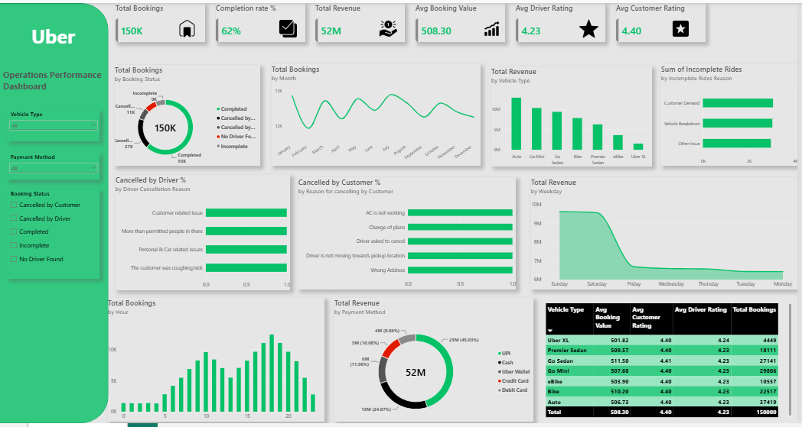

# Uber Operations Performance Dashboard

## 📌 Project Overview
This project analyzes ride booking data for an on-demand cab service (NCR region) to uncover insights on bookings, revenue, cancellations, and customer/driver performance. The analysis combines SQL for data querying with Power BI for interactive visualization.

## 📊 Dataset
- **Source file:** ncr_ride_bookings.csv
- **Size:** ~150,000 rows
- **Fields:** Booking status, vehicle type, booking value, ride distance, pickup/drop location, payment method, driver & customer ratings, cancellation reasons, VTAT/CTAT timings, and more.

## 🛠️ Tools Used
- **SQL (MySQL)** – data querying and aggregation
- **Power BI** – interactive dashboard and visualizations
- **Excel** – data export and supporting analysis

## 🔍 Key Analysis Areas
- Overall booking status split (completed, cancelled, incomplete)
- Revenue, average booking value & distance by vehicle type
- Monthly and weekday booking trends
- Peak hour analysis
- Top pickup locations and top customers by spend
- Customer & driver cancellation reasons
- Payment method distribution and revenue share
- Average driver & customer ratings by vehicle type
- Average VTAT (arrival time) & CTAT (trip time) by vehicle type
- Overall cancellation and completion rates

## 📁 Files in this Repository
| File | Description |
|------|-------------|
| `uber_operations_queries.sql` | Full set of SQL queries used for the analysis |
| `NCR_Ride_Bookings_Dashboard.pbix` | Power BI dashboard file |
| Excel export file | Supporting data export |
| Dashboard screenshot | Preview image of the Power BI dashboard |

## 📈 Dashboard Preview

## 💡 Key Insights
- Identified the share of completed vs cancelled vs incomplete bookings
- Found top-performing vehicle types by revenue and rating
- Highlighted peak booking hours and high-demand pickup locations
- Analyzed leading causes of customer and driver cancellations

## 🔗 Connect
- **Portfolio:** https://parthibanvofficial02.github.io/
- **GitHub:** https://github.com/parthibanvofficial02
